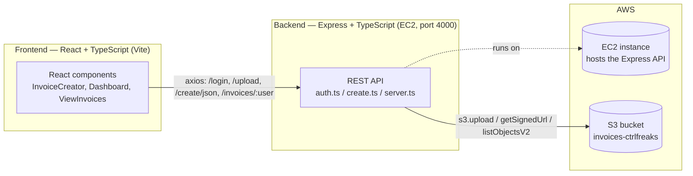
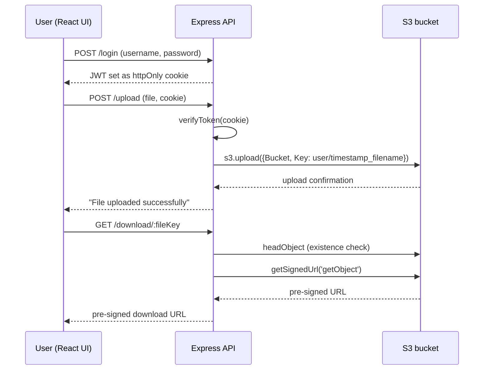

# Invoice_Creation_For_SMEs

## Architecture

## Invoice upload & retrieval flow

**What each piece does:**
- **React + TypeScript (frontend)** — Vite app under `invoice_creation/frontend`, built with MUI. Components poll `/alive`, submit invoices via JSON/CSV/manual entry, and call the backend with `axios`.
- **Express + TypeScript (backend)** — `invoice_creation/backend/src/server.ts` exposes REST endpoints for auth (JWT cookie), UBL invoice generation, and S3 file upload/download/listing.
- **AWS S3** — stores uploaded invoice files, keyed by `username/timestamp_filename`; downloads go through short-lived pre-signed URLs rather than public access.
- **AWS EC2** — `server.ts` binds to `0.0.0.0` when it detects it's running as the `ubuntu` user, which is how the API is hosted on an EC2 instance rather than localhost.

> **Not present in this repo:** there is no GPT-4/OpenAI integration anywhere in the codebase — none of the source, `package.json` files, or workflows reference it. Let me know if it's planned, lives in another repo, or you meant a different piece, and I'll add an accurate diagram for it.

> **Security note:** `invoice_creation/backend/src/server.ts` currently has a live AWS access key and secret hardcoded (not an env var). Recommend rotating that key in the AWS console and loading credentials from environment variables instead.
